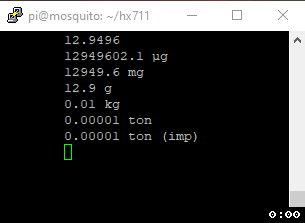

# Raspberry Pi HX711 C++ Library

[](https://github.com/endail/hx711/actions/workflows/buildcheck.yml)
[](https://github.com/endail/hx711/actions/workflows/cppcheck.yml)
[](https://github.com/endail/hx711/actions/workflows/codeql-analysis.yml)

- Use with Raspberry Pi
- Requires [lgpio](http://abyz.me.uk/lg/index.html)

## Sample Output from Test Code

See: [`src/SimpleHX711Test.cpp`](https://github.com/endail/hx711/blob/master/src/SimpleHX711Test.cpp)



The .gif above illustrates the output of the test code where I applied pressure to the load cell. The HX711 chip was operating at 80Hz. However, note from the code that the value being used is [the median of five samples](https://github.com/endail/hx711/blob/master/src/SimpleHX711Test.cpp#L50) from the sensor.

## Documentation

### Pins

Unless otherwise stated, use [GPIO](https://pinout.xyz/) pin numbering. You do not need to use the dedicated SPI or I2C pins. The HX711 is **not** an I2C device. Any pin capable of input and output may be used.

There are two relevant classes for interfacing with a HX711: `SimpleHX711` and `AdvancedHX711`.

### SimpleHX711( int dataPin, int clockPin, Value refUnit = 1, Value offset = 0, Rate rate = Rate::HZ_10 )

- **data pin**: Raspberry Pi pin which connects to the HX711 chip's data pin (also referred to as DOUT).

- **clock pin**: Raspberry Pi pin which connects to the HX711 chip's clock pin (also referred to as PD_SCK).

- **reference unit**: load cell's reference unit. Find this value with the calibration program, otherwise set it to 1.

- **offset**: load cell's offset from zero. Find this value with the calibration program, otherwise set it to 0.

- **rate**: HX711 chip's data rate. Changing this does **not** alter the rate at which the HX711 chip outputs data. On breakout boards such as Sparkfun's HX711, this will likely be 10Hz by default. It is not necessary for this to be accurate, but is used to determine the correct data settling time.

As the name implies, this is a simple interface to the HX711 chip. Its core operation is busy-waiting. It will continually check - as fast as possible - whether data is ready to be obtained from the HX711 module. This is both its advantage and disadvantage. It is _fast_, but uses more of the CPU.

### AdvancedHX711( int dataPin, int clockPin, Value refUnit = 1, Value offset = 0, Rate rate = Rate::HZ_10 )

Arguments are identical to `SimpleHX711`.

The `AdvancedHX711` is an effort to minimise the time spent by the CPU checking whether data is ready to be obtained from the HX711 module, while remaining as efficient as possible. Its core operation, in contrast to `SimpleHX711`, is through the use of a separate thread of execution to intermittently watch for and collect available data, thereby minimising CPU time.

### HX711

`SimpleHX711` and `AdvancedHX711` both inherit from the `HX711` class and provide these additional functions.

- `void setStrictTiming( bool strict )`. The HX711 chip has specific timing requirements which if not adhered to may lead to corrupt data. If strict timing is enabled, an `IntegrityException` will be thrown when data integrity cannot be guaranteed. However, given the unreliability of timing on a non-realtime OS, this in itself is unreliable and therefore disabled by default. Use at your own risk.

- `void setFormat( Format bitFormat )`. Defines the format of bits when read from the HX711 chip. Either `Format::MSB` (most significant bit first - the default) or `Format::LSB` (least significant bit first).

- `void powerUp()`

- `void powerDown()`

- `void setConfig( Channel c = Channel::A, Gain g = Gain::GAIN_128 )`. Changes the channel and gain of the HX711 chip. An `std::invalid_argument` exception will be thrown if the channel and gain combination is invalid as per the datasheet.

### AbstractScale

`SimpleHX711` and `AdvancedHX711` also both inherit from the `AbstractScale` class. This is the interface between raw data values from the HX711 chip and scale functionality.

- `Mass::Unit getUnit()` and `void setUnit( Mass::Unit unit )`. Gets and sets the default unit the scale will return weights in. For example, if set to `Mass::Unit::KG`, the scale will output a weight in kilograms.

- `Value getReferenceUnit()` and `void setReferenceUnit( Value refUnit )`. See calibration program.

- `Value getOffset()` and `void setOffset( Value offset )`. Offset from zero. See calibration program.

- `double normalise( double v )`. Given a raw value from HX711, returns a "normalised" value according to the scale's reference unit and offset.

- `double read( Options o = Options() )`. Obtains values from the HX711 according to given `Options` and performs normalisation.

- `void zero( Options o = Options() )`. Zeros the scale.

- `Mass weight( Options o = Options() )`. Returns the current weight on the scale.

### Options

You will notice in the functions above there is an `Options` parameter. This determines _how_ data is collected and interpreted according to a `StrategyType` and `ReadType`.

- `StrategyType::Samples` instructs the scale to collect `Options.samples` number of samples.

- `StrategyType::Time` instructs the scale to collect as many samples as possible within the time period `Options.timeout`.

- `ReadType::Median` instructs the scale to use the median value from the collected samples.

- `ReadType::Average` instructs the scale to use the average value from the collected samples.

## Examples

### SimpleHX711 Example

```c++
  // create a SimpleHX711 object using GPIO pin 2 as the data pin,
  // GPIO pin 3 as a the clock pin, -370 as the reference unit, and
  // -367471 as the offset.
  SimpleHX711 hx(2, 3, -370, -367471);

  // set the scale to output weights in ounces
  hx.setUnit(Mass::Unit::OZ);

  // constantly output weights using the median of 35 samples
  for(;;) cout << hx.weight(35) << endl; //eg. 1.08 oz
```


### AdvancedHX711 Example

```c++
  AdvancedHX711 hx(2, 3);

  // constantly output weights using the median of all samples
  // obtained within 1 second
  for(;;) cout << hx.weight(seconds(1)) << endl; //eg. 0.03 g
```

## Build and Install

```shell
pi@raspberrypi~ $ git clone https://github.com/endail/hx711
pi@raspberrypi~ $ cd hx711
pi@raspberrypi~/hx711 $ make && sudo make install
```

## Calibrate

`make` will create the executable `bin/hx711calibration` in the project directory. You can use this to calibrate your load cell and HX711 chip. Run it as follows and follow the prompts:

- **data pin**: Raspberry Pi pin which connects to the HX711 chip's data pin.

- **clock pin**: Raspberry Pi pin which connects to the HX711 chip's clock pin.

Example using GPIO pin 2 for data and pin 3 for clock.

```shell
pi@raspberrypi~/hx711 $ bin/hx711calibration 2 3
```

## Test

`make` will create the executables `bin/simplehx711test` and `bin/advancedhx711test` in the project directory. You can use these programs to test your load cell and HX711 module. Arguments are as follows:

- **data pin**: Raspberry Pi pin which connects to the HX711 chip's data pin.

- **clock pin**: Raspberry Pi pin which connects to the HX711 chip's clock pin.

- **reference unit**: load cell's reference unit. Find this value with the calibration program above, otherwise set it to 1.

- **offset**: load cell's offset from zero. Find this value with the calibration program above, otherwise set it to 0.
`
Example using GPIO pin 2 for data, GPIO pin 3 for clock, -377 as the reference unit, and -363712 as the offset:

```shell
pi@raspberrypi~/hx711 $ bin/simplehx711test 2 3 -377 -363712
```

## Use

After writing your own code (eg. main.cpp), compile with the HX711 and lgpio libraries as follows:

```shell
g++ -Wall -o prog main.cpp -lhx711 -llgpio
```
