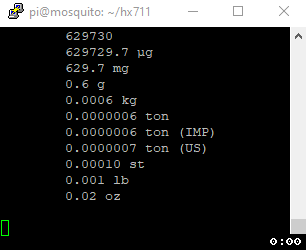

# Raspberry Pi HX711 C++ Library

[](https://github.com/endail/hx711/actions/workflows/buildcheck.yml) [](https://github.com/endail/hx711/actions/workflows/cppcheck.yml) [](https://github.com/endail/hx711/actions/workflows/codeql-analysis.yml)

- Use with Raspberry Pi
- Requires [lgpio](http://abyz.me.uk/lg/index.html)
- Developed and tested with a Raspberry Pi Zero W

## Sample Output from Test Code

See: [`src/SimpleHX711Test.cpp`](src/SimpleHX711Test.cpp)



The .gif above illustrates the output of the test code where I applied pressure to the load cell. The HX711 chip was operating at 80Hz. However, note from the code that the value being used is the median of three samples from the sensor.

## Examples

### SimpleHX711 Example

```c++
#include <iostream>
#include <hx711/common.h>

int main() {

  using namespace HX711;

  // create a SimpleHX711 object using GPIO pin 2 as the data pin,
  // GPIO pin 3 as the clock pin, -370 as the reference unit, and
  // -367471 as the offset
  SimpleHX711 hx(2, 3);

  // set the scale to output weights in ounces
  hx.setUnit(Mass::Unit::OZ);

  // constantly output weights using the median of 35 samples
  for(;;) std::cout << hx.weight(35) << std::endl; //eg. 1.08 oz

  return 0;

}
```

### AdvancedHX711 Example

```c++
#include <chrono>
#include <iostream>
#include <hx711/common.h>

int main() {

  using std::chrono::seconds;

  // create an AdvancedHX711 object using GPIO pin 2 as the data pin,
  // GPIO pin 3 as the clock pin, -370 as the reference unit, -367471
  // as the offset, and indicate that the chip is operating at 80Hz
  HX711::AdvancedHX711 hx(2, 3, -370, -367471, Rate::HZ_80);

  // constantly output weights using the median of all samples
  // obtained within 1 second
  for(;;) std::cout << hx.weight(seconds(1)) << std::endl; //eg. 0.03 g

  return 0;

}
```

## Documentation

### Datasheet

[Revision 2.0](resources/hx711F_EN.pdf)

### Wiring and Pins

The Sparkfun website has a [tutorial](https://learn.sparkfun.com/tutorials/load-cell-amplifier-hx711-breakout-hookup-guide) on how to connect a HX711 breakout board to a load cell and to a microcontroller such as an Arduino. When connecting to a Raspberry Pi, the only significant difference is to connect the breakout board's `VCC` pin to a Raspberry Pi [5v pin](https://pinout.xyz/pinout/5v_power), and the `VDD` pin to a Raspberry Pi [3.3v pin](https://pinout.xyz/pinout/3v3_power). **Be very careful not to confuse the two or you could damage your Raspberry Pi**.

Unless otherwise stated, use [GPIO](https://pinout.xyz/) pin numbering. You do not need to use the dedicated Raspberry Pi [SPI](https://pinout.xyz/pinout/spi) or [I2C](https://pinout.xyz/pinout/i2c) pins. The HX711 is **not** an I2C device. Any pin capable of input and output may be used.

---

There are two relevant classes for interfacing with a HX711: `SimpleHX711` and `AdvancedHX711`.

### [SimpleHX711( int dataPin, int clockPin, Value refUnit = 1, Value offset = 0, Rate rate = Rate::HZ_10 )](include/SimpleHX711.h)

- **dataPin**: Raspberry Pi pin which connects to the HX711 chip's data pin (also referred to as DOUT).

- **clockPin**: Raspberry Pi pin which connects to the HX711 chip's clock pin (also referred to as PD_SCK).

- **refUnit**: load cell's reference unit. Find this value with the calibration program described below, otherwise set it to 1.

- **offset**: load cell's offset from zero. Find this value with the calibration program described below, otherwise set it to 0.

- **rate**: HX711 chip's data rate. Changing this does **not** alter the rate at which the HX711 chip outputs data, but it is used to determine the correct data settling time. Changing the data rate requires modification of the hardware. On [Sparkfun's HX711 breakout board](https://www.sparkfun.com/products/13879), there is a [jumper on the bottom of the board](resources/13879-SparkFun_Load_Cell_Amplifier_-_HX711-03.jpg) labelled `RATE`. By default, the jumper is closed, which sets the data rate to 10Hz. Opening the jumper (by cutting between the solder pads with a blade, desoldering, etc...) sets the data rate to 80Hz. Also see `SJ2` in the [schematic](resources/SparkFun_HX711_Load_Cell.pdf).

As the name implies, this is a simple interface to the HX711 chip. Its core operation is [busy-waiting](https://en.wikipedia.org/wiki/Busy_waiting). It will continually check whether data is ready to be obtained from the HX711 chip. This is both its advantage and disadvantage. It is as fast as possible, but uses more of the CPU's time.

---

### [AdvancedHX711( int dataPin, int clockPin, Value refUnit = 1, Value offset = 0, Rate rate = Rate::HZ_10 )](include/AdvancedHX711.h)

Arguments are identical to `SimpleHX711`.

The `AdvancedHX711` is an effort to minimise the time spent by the CPU checking whether data is ready to be obtained from the HX711 module while remaining as efficient as possible. Its core operation, in contrast to `SimpleHX711`, is through the use of a separate thread of execution to intermittently watch for and collect available data when it is available.

---

### [HX711](include/HX711.h)

`SimpleHX711` and `AdvancedHX711` both inherit from the `HX711` class and provide these additional functions.

- `void powerUp()`

- `void powerDown()`

- `void setStrictTiming( bool strict )`. The HX711 chip has specific timing requirements which if not adhered to may lead to corrupt data. If strict timing is enabled, an `IntegrityException` will be thrown when data integrity cannot be guaranteed. However, given the unreliability of timing on a non-realtime OS (such as Raspbian on a Raspberry Pi), this in itself is unreliable and therefore disabled by default. Use at your own risk.

- `void setFormat( Format bitFormat )`. Defines the format of bits when read from the HX711 chip. Either `Format::MSB` (most significant bit first - the default) or `Format::LSB` (least significant bit first).

- `void setConfig( Channel c = Channel::A, Gain g = Gain::GAIN_128 )`. Changes the channel and gain of the HX711 chip. An `std::invalid_argument` will be thrown if the given channel and gain are incompatible. See the datasheet for more information.

---

### [AbstractScale](include/AbstractScale.h)

`SimpleHX711` and `AdvancedHX711` also both inherit from the `AbstractScale` class. This is the interface between raw data values from the HX711 chip and the functionality of a scale.

- `Mass::Unit getUnit()` and `void setUnit( Mass::Unit unit )`. Gets and sets the unit the scale will return weights in. For example, if set to `Mass::Unit::KG`, the scale will output a weight in kilograms. The default unit is grams (`Mass::Unit::G`).

- `Value getReferenceUnit()` and `void setReferenceUnit( Value refUnit )`. See calibration program.

- `Value getOffset()` and `void setOffset( Value offset )`. Offset from zero. See calibration program.

- `double normalise( double v )`. Given a raw value from HX711, returns a "normalised" value according to the scale's reference unit and offset.

- `double read( Options o = Options() )`. Obtains values from the HX711 according to given `Options`. You should call this method if you want to deal with the numeric values from the scale rather than `.weight()` which returns the numeric value as a `Mass` object.

- `void zero( Options o = Options() )`. Zeros the scale.

- `Mass weight( Options o = Options() )`. Returns the current weight on the scale according to the given `Options`.

- `Mass weight( std::size_t samples )`. Returns the current weight on the scale using the median value from `samples` number of samples.

- `Mass weight( std::chrono::nanoseconds timeout )`. Returns the current weight on the scale using the median value from all samples collected within the `timeout` period.

---

### Options

You will notice in the functions above there is an `Options` parameter. This determines how data is collected and interpreted according to a `StrategyType` and `ReadType`.

- `StrategyType::Samples` instructs the scale to collect `Options.samples (std::size_t)` number of samples. This is the default.

- `StrategyType::Time` instructs the scale to collect as many samples as possible within the time period `Options.timeout (std::chrono::nanoseconds)`.

- `ReadType::Median` instructs the scale to use the median value from the collected samples. This is the default.

- `ReadType::Average` instructs the scale to use the average value from the collected samples.

---

### [Mass](include/Mass.h)

`Mass` is a self-contained class to easily convert between units of mass. A `Mass` object contains a value stored as a `double` and a `Mass::Unit` representing the unit of that value. Methods of the `Mass` class you may find particularly useful include:

- `Unit getUnit()` and `setUnit( Unit u )` to find and change the unit of mass.

- `Mass convertTo( Unit to )` to return a new `Mass` object with the given `to` unit.

- `std::string toString()` which returns a formatted string containing the value of the `Mass` object in the accompanying unit of mass, followed the unit name. eg. "1.03 kg".

- `std::string toString( Unit u )` which performs the same function as above, except according to the given `Unit` `u`.

- `std::ostream& operator<<( std::ostream& os, Mass& m )` to send the output of `toString()` to the `ostream`. For example:

```c++
Mass m(1.03, Mass::Unit::KG);
std::cout << m; //1.03 kg
```

### Noise

It is possible that the HX711 chip will return - or the code will read - an invalid value or "noise". I have opted not to filter these values in this library and instead leave them up to the individual developer on how best to go about doing so for their individual application.

With that said, if you are looking for a simple but effective method to filter momentary noise, I highly recommend taking the median of at least three samples from the sensor. The [SimpleHX711Test.cpp code](src/SimpleHX711Test.cpp) does this and can be seen in the .gif above.

### Other Notes

- All HX711 library code exists within the `HX711` namespace

- After building and installing the library (see below), you can `#include <hx711/common.h>` to include everything

- `sudo make uninstall` from the project directory to remove the library

- If you are looking for a version of this library which uses wiringPi rather than lgpio, [v1.1 is available](https://github.com/endail/hx711/releases/tag/1.1). However, given that [wiringPi is deprecated](http://wiringpi.com/wiringpi-deprecated/), I have chosen to use lgpio going forward.

## Build and Install

```console
pi@raspberrypi:~ $ git clone https://github.com/endail/hx711
pi@raspberrypi:~ $ cd hx711
pi@raspberrypi:~/hx711 $ make && sudo make install
```

## Calibrate

`make` will create the executable `bin/hx711calibration` in the project directory. You can use this to calibrate your load cell and HX711 chip. Arguments are as follows:

- **data pin**: Raspberry Pi pin which connects to the HX711 chip's data pin.

- **clock pin**: Raspberry Pi pin which connects to the HX711 chip's clock pin.

Example using GPIO pin 2 for data and GPIO pin 3 for clock.

```console
pi@raspberrypi:~/hx711 $ bin/hx711calibration 2 3
```

## Test

`make` will create the executables `bin/simplehx711test` and `bin/advancedhx711test` in the project directory. You can use these programs to test your load cell and HX711 module. Arguments are as follows:

- **data pin**: Raspberry Pi pin which connects to the HX711 chip's data pin.

- **clock pin**: Raspberry Pi pin which connects to the HX711 chip's clock pin.

- **reference unit**: load cell's reference unit. Find this value with the calibration program above, otherwise set it to 1.

- **offset**: load cell's offset from zero. Find this value with the calibration program above, otherwise set it to 0.

Example using GPIO pin 2 for data, GPIO pin 3 for clock, -377 as the reference unit, and -363712 as the offset:

```console
pi@raspberrypi:~/hx711 $ bin/simplehx711test 2 3 -377 -363712
```

## Use

After writing your own code (eg. main.cpp), compile and link with the HX711 and lgpio libraries as follows:

```console
pi@raspberrypi:~ $ g++ -Wall -o prog main.cpp -lhx711 -llgpio
```
